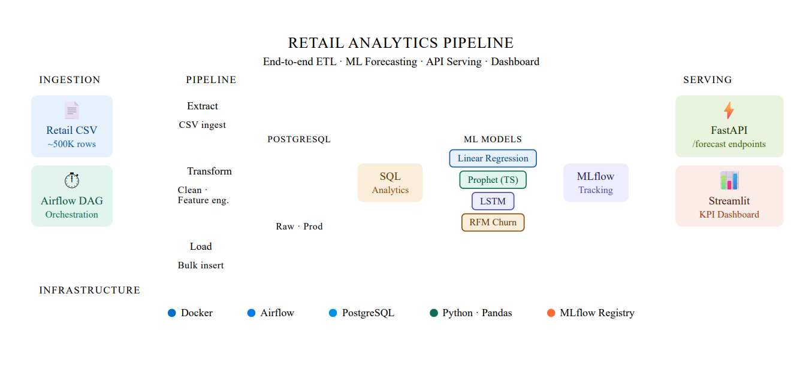

# Retail Analytics ETL + ML Forecasting Pipeline

## Overview

This project is an end-to-end **Data Engineering + Machine Learning pipeline** built to transform raw retail transaction data into actionable business insights and future sales forecasts.

It demonstrates how raw CSV data can be processed through a structured ETL pipeline, stored in a relational database, analyzed using SQL, and further leveraged for predictive modeling and API-based serving.

The system is designed with a **production-style mindset**, integrating data processing, analytics, machine learning, and deployment layers into a single cohesive pipeline.

---

## Architecture Diagram

<p align="center">
  
</p>

## Pipeline Flow

```
Data Sources → ETL Pipeline → Data Cleaning & Transformation → PostgreSQL → SQL Analytics → ML Models → MLflow Tracking → FastAPI → Streamlit Dashboard
```

---

## Tech Stack

**Data Engineering**

* Python (Pandas)
* PostgreSQL
* SQL

**Machine Learning**

* Scikit-learn (Linear Regression)
* Prophet (Time Series Forecasting)
* TensorFlow / Keras (LSTM)

**MLOps**

* MLflow (Experiment Tracking)

**Serving Layer**

* FastAPI

**Visualization**

* Streamlit
* Power BI

**Orchestration & Infra**

* Airflow (DAG Prototype)
* Docker

---

## Key Features

* End-to-end ETL pipeline from raw data to insights
* Data cleaning and feature engineering (TotalPrice, RFM)
* PostgreSQL-based structured storage
* SQL-driven business analytics
* Multi-model forecasting (LR, Prophet, LSTM)
* Customer churn prediction using RFM
* MLflow experiment tracking (parameters, metrics, runs)
* FastAPI endpoints for real-time predictions
* Streamlit dashboard with KPIs and visual insights
* Modular and production-style architecture

---

## Data Pipeline

### Extract

* Retail transaction dataset (~500K records)
* Includes invoices, products, customers, and pricing data

### Transform

* Removed missing Customer IDs
* Filtered invalid Quantity and Price values
* Converted InvoiceDate to datetime format
* Created TotalPrice feature
* Built RFM (Recency, Frequency, Monetary) features

### Load

* Stored cleaned data into PostgreSQL (`retail_data` table)

---

## Data Processing

Key transformation:

```python
df["TotalPrice"] = df["Quantity"] * df["Price"]
```

Additional processing includes:

* Null handling
* Type casting
* Aggregations for daily sales
* Feature engineering for ML models

---

## SQL Analytics

Business insights generated using SQL:

* Total Revenue
* Total Customers
* Total Orders
* Top Products
* Top Customers
* Country-wise Revenue
* Daily Sales Trends

---

## Machine Learning Models

### Linear Regression

* Baseline model for sales forecasting

### Prophet

* Time-series forecasting with trend and seasonality

### LSTM

* Deep learning model capturing sequential patterns

### Churn Prediction

* Built using RFM features to identify high-risk customers

---

## MLOps (MLflow)

* Tracks experiments, parameters, and metrics
* Maintains run history for reproducibility
* Enables comparison between models

---

## API Layer (FastAPI)

Endpoints:

```
/health
/forecast/baseline
/forecast/prophet
/forecast/lstm
```

Purpose:

* Serve model predictions via REST API
* Enable integration with external systems
* Provide real-time forecast outputs

---

## Dashboard

Built using Streamlit:

* KPI Cards (Revenue, Customers, Orders)
* Sales Trend Visualization
* Forecast Charts
* Product and Customer Insights

Also integrated with Power BI for advanced reporting.

---

## Project Structure

```
├── api.py
├── app.py
├── etl_pipeline.py
├── forecast_model.py
├── prophet_forecast.py
├── LSTM_forecast.py
├── churn_model.py
├── retail_pipeline_dag.py
├── requirements.txt
├── data/
├── screenshots/
├── sql_queries.sql
└── README.md
```

---

## How to Run

### Install dependencies

```
pip install -r requirements.txt
```

### Run ETL pipeline

```
python etl_pipeline.py
```

### Run Streamlit dashboard

```
streamlit run app.py
```

### Run FastAPI

```
uvicorn api:app --reload
```

Open:

```
http://127.0.0.1:8000/docs
```

### Run MLflow

```
mlflow ui
```

Open:

```
http://127.0.0.1:5000
```

---

## Business Impact

* Automated data preparation pipeline
* Enabled real-time sales forecasting
* Provided insights into customer behavior and product performance
* Improved decision-making using predictive analytics
* Demonstrated integration of Data Engineering + ML + APIs

---

## Engineering Highlights

* Modular pipeline design
* Separation of ETL, ML, and API layers
* Experiment tracking with MLflow
* API-based model serving
* Dashboard-driven analytics
* Scalable and production-style workflow

---

## Future Improvements

* Real-time streaming using Kafka
* Cloud deployment (AWS / Azure)
* CI/CD pipeline integration
* Model monitoring and drift detection

---

## Author

Samyak Kamble
Data Engineering Enthusiast
